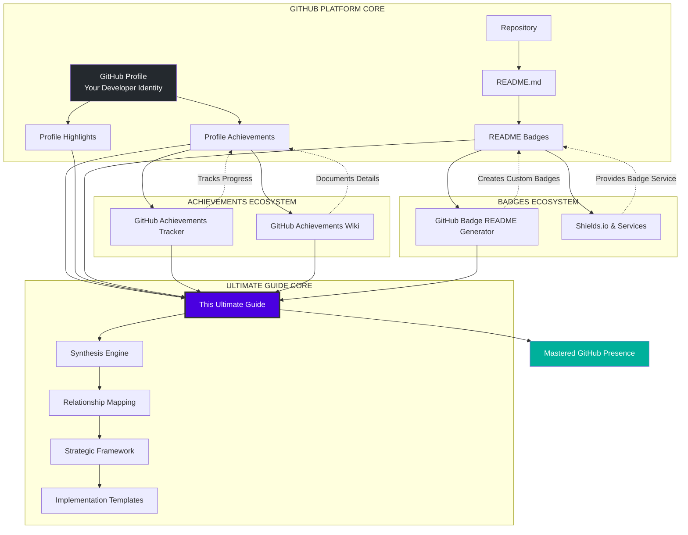
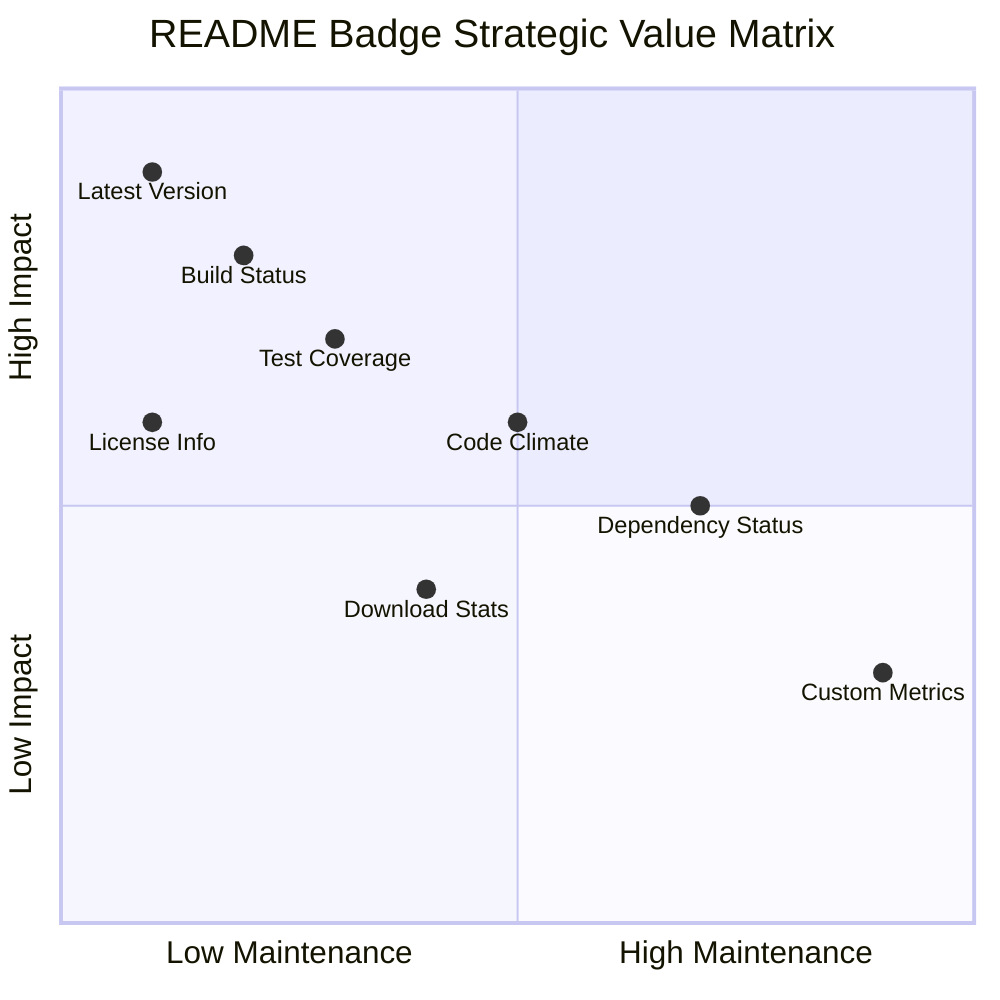
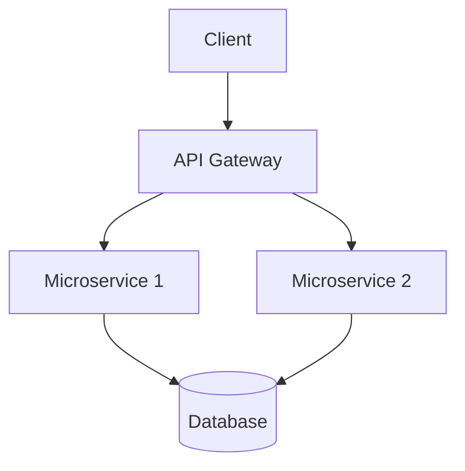
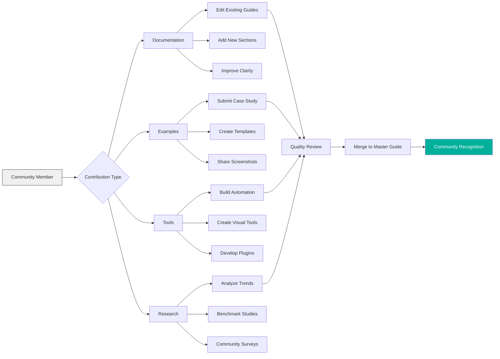

# 🌟 GitHub Badge Ultimate Guide: The Master Reference

<div align="center">


# 🏆 **The Complete Encyclopedia of GitHub Recognition Systems**

### **From Profile Achievements to README Mastery – Everything Connected, Everything Explained**

[](https://github.com/AshrafMorningstar/GitHub-Badge-Ultimate-Guide/wiki)
[](https://ashrafmorningstar.github.io/GitHub-Badge-Ultimate-Guide/)
[](CONTRIBUTING.md)


</div>

## 🌌 Introduction: The Grand Unification Theory of GitHub Visuals

Welcome to the **GitHub Badge Ultimate Guide**, the definitive master reference that connects, explains, and elevates every visual recognition system on the GitHub platform. This isn't just another tutorial—it's the **central nervous system** of GitHub's visual identity ecosystem, the **Rosetta Stone** that translates between different badge languages, and the **strategic playbook** for crafting your perfect developer presence.

### 🎯 **Why This Guide Exists**

GitHub's visual systems have evolved into three distinct but interconnected realms:
- **🏅 Profile Achievements** (automated recognition)
- **💎 Profile Highlights** (status indicators)  
- **🛡️ README Badges** (customizable project metadata)

Most developers understand these in isolation. This guide provides the **missing connections**, the **strategic insights**, and the **practical blueprints** to master them all as a unified system.

## 🏛️ Architectural Overview: The Complete Ecosystem



## 📚 The Complete Taxonomy of GitHub Visual Systems

### 🏅 **Tier 1: Profile Achievements (GitHub-Awarded)**
*Automatically earned badges for specific community activities*

| Category | Badge | Unlock Criteria | Rarity | Strategic Value |
|----------|-------|-----------------|--------|-----------------|
| **Collaboration** | 🦈 Pull Shark | Get PRs merged | Common | Shows teamwork ability |
| **Responsiveness** | ⚡ Quickdraw | Close issues/PRs in <5min | Rare | Demonstrates active maintenance |
| **Popularity** | 🌟 Starstruck | Repository reaches 16+ stars | Common | Social proof of project quality |
| **Knowledge** | 🧠 Galaxy Brain | 2+ accepted discussion answers | Uncommon | Positions you as community expert |
| **Sponsorship** | ❤️ Public Sponsor | Sponsor open source work | Rare | Shows commitment to OSS ecosystem |
| **Historical** | 🗃️ Arctic Code Vault | Code in 2020 GitHub Archive | Legendary* | Prestige badge (no longer earnable) |

### 💎 **Tier 2: Profile Highlights (Status Indicators)**
*Badges representing program membership or special status*

| Highlight | Icon | Represents | How to Obtain |
|-----------|------|------------|---------------|
| **GitHub Pro** | ⚡ | Active paid subscription | Purchase GitHub Pro |
| **Security Bug Bounty** | 🐛 | Reported security vulnerability | Find & report security bugs |
| **Campus Expert** | 🎓 | Student leader in program | Apply to GitHub Campus Program |
| **Developer Program** | 🛠️ | GitHub Developer Program | Join developer program |
| **Advisory Credit** | 🛡️ | Accepted security advisory | Submit to Advisory Database |

### 🛡️ **Tier 3: README Badges (Developer-Created)**
*Custom status images for repository README files*



## 🏗️ Project Structure & Content Architecture

```
GitHub-Badge-Ultimate-Guide/
│
├── 📂 MASTER-GUIDE/                    # Core guide content
│   ├── 📁 foundations/                 # Foundational concepts
│   │   ├── 01-ecosystem-overview.md
│   │   ├── 02-taxonomy-classification.md
│   │   └── 03-strategic-framework.md
│   │
│   ├── 📁 achievements-mastery/        # Deep dive: Profile Achievements
│   │   ├── 01-complete-achievement-list.md
│   │   ├── 02-unlock-strategies/
│   │   │   ├── pull-shark-mastery.md
│   │   │   ├── quickdraw-techniques.md
│   │   │   └── galaxy-brain-approach.md
│   │   ├── 03-progression-tracking.md
│   │   └── 04-historical-context.md
│   │
│   ├── 📁 badges-mastery/             # Deep dive: README Badges
│   │   ├── 01-badge-typology.md
│   │   ├── 02-service-comparison/
│   │   │   ├── shields-io-guide.md
│   │   │   ├── badgen-network.md
│   │   │   └── custom-services.md
│   │   ├── 03-advanced-techniques/
│   │   │   ├── dynamic-badges.md
│   │   │   ├── conditional-display.md
│   │   │   └── performance-optimization.md
│   │   └── 04-design-principles.md
│   │
│   ├── 📁 integration-patterns/       # How systems work together
│   │   ├── 01-holistic-profile-design.md
│   │   ├── 02-repository-strategy.md
│   │   ├── 03-career-narrative.md
│   │   └── 04-advanced-synergies.md
│   │
│   └── 📁 case-studies/              # Real-world examples
│       ├── open-source-maintainer.md
│       ├── enterprise-developer.md
│       ├── student-portfolio.md
│       └── technical-writer.md
│
├── 📂 TEMPLATES-AND-TOOLS/           # Practical resources
│   ├── 📁 profile-templates/
│   │   ├── beginner-friendly.md
│   │   ├── open-source-focused.md
│   │   ├── enterprise-ready.md
│   │   └── portfolio-optimized.md
│   │
│   ├── 📁 badge-configurations/
│   │   ├── standard-sets/
│   │   │   ├── web-development.md
│   │   │   ├── data-science.md
│   │   │   └── devops-infrastructure.md
│   │   ├── dynamic-badge-recipes/
│   │   │   ├── github-actions-workflows/
│   │   │   └── serverless-functions/
│   │   └── advanced-layouts.md
│   │
│   ├── 📁 automation-scripts/
│   │   ├── badge-updater/
│   │   ├── achievement-tracker/
│   │   └── profile-sync/
│   │
│   └── 📁 design-resources/
│       ├── color-palettes.md
│       ├── icon-libraries.md
│       └── layout-grids.md
│
├── 📂 COMMUNITY-KNOWLEDGE/           # Crowdsourced wisdom
│   ├── 📁 contributed-guides/
│   ├── 📁 faq-evolution/
│   ├── 📁 myth-busting/
│   └── 📁 translation-projects/
│
├── 📂 INTERACTIVE-TOOLS/             # Web-based tools
│   ├── badge-strategy-planner/
│   ├── achievement-roadmap-generator/
│   ├── readme-visual-editor/
│   └── profile-audit-tool/
│
├── 📂 ASSETS/                       # Visual assets
│   ├── 📁 diagrams/                 # All Mermaid/SVG diagrams
│   ├── 📁 screenshots/              # Reference images
│   ├── 📁 templates-visual/         # Visual template previews
│   └── 📁 icons-vectors/            # Custom icon sets
│
└── README.md                        # This master document
```

## 🎨 Premium Design System

### Visual Identity Framework
```css
/* Ultimate Guide Design Tokens */
:root {
  /* Primary Color Palette */
  --guide-primary: #4a00e0;
  --guide-secondary: #8a2be2;
  --guide-accent: #00b09b;
  --guide-neutral: #2d3748;
  
  /* Gradient System */
  --gradient-premium: linear-gradient(135deg, 
    var(--guide-primary) 0%, 
    var(--guide-secondary) 50%, 
    var(--guide-accent) 100%);
  
  /* Typography Scale */
  --font-display: 'Inter', -apple-system, system-ui, sans-serif;
  --font-mono: 'JetBrains Mono', 'SF Mono', monospace;
  --font-decorative: 'Poppins', sans-serif;
  
  /* Spacing System */
  --space-3d: 0 20px 60px rgba(0, 0, 0, 0.3);
  --space-elevated: 0 10px 40px rgba(0, 0, 0, 0.1);
  
  /* Animation Library */
  --animation-smooth: cubic-bezier(0.4, 0, 0.2, 1);
  --animation-bounce: cubic-bezier(0.68, -0.55, 0.265, 1.55);
}

/* Component Styling */
.guide-card {
  background: rgba(255, 255, 255, 0.05);
  backdrop-filter: blur(10px);
  border: 1px solid rgba(255, 255, 255, 0.1);
  border-radius: 16px;
  transition: all 0.3s var(--animation-smooth);
}

.guide-card:hover {
  transform: translateY(-4px);
  box-shadow: var(--space-3d);
  border-color: var(--guide-accent);
}
```

## 🚀 Implementation Roadmap

### Phase 1: Foundation (Completed)
- [x] **Ecosystem Mapping**: Complete taxonomy of all GitHub visual systems
- [x] **Relationship Analysis**: How systems interconnect and influence each other
- [x] **Strategic Framework**: Development of mastery pathways
- [x] **Template Library**: Creation of implementation templates

### Phase 2: Enhancement (Current)
- [ ] **Interactive Tools**: Web-based planning and strategy tools
- [ ] **Advanced Automation**: Scripts for badge management and tracking
- [ ] **Case Study Expansion**: 50+ real-world implementation examples
- [ ] **Performance Optimization**: Guides for badge loading performance

### Phase 3: Mastery (Future)
- [ ] **AI-Powered Recommendations**: Personalized badge strategy suggestions
- [ ] **Integration Platform**: Unified dashboard for all badge systems
- [ ] **Community Analytics**: Insights from aggregated badge usage data
- [ ] **Certification Program**: Official mastery certification

## 🔧 Technical Implementation Guide

### Creating the Ultimate README
```markdown
<!-- Ultimate README Template -->
# 🚀 Project Name

<!-- Achievement Showcase -->
## 🏆 GitHub Achievements Status


<!-- Project Health Badges -->
## 📊 Project Health


<!-- Skill Demonstration -->
## 🛠️ Tech Stack


<!-- System Architecture -->
## 🏗️ Architecture


<!-- Dynamic Badges Section -->
## 📈 Live Metrics
-blue?style=for-the-badge)
-orange?style=for-the-badge)
```

### Advanced Dynamic Badge Setup
```yaml
# GitHub Actions workflow for dynamic badges
name: Update Dynamic Badges
on:
  schedule:
    - cron: '0 */6 * * *'  # Every 6 hours
  push:
    branches: [ main ]

jobs:
  update-badges:
    runs-on: ubuntu-latest
    steps:
      - uses: actions/checkout@v3
      
      - name: Calculate Metrics
        id: metrics
        run: |
          COMMITS=$(git rev-list --count HEAD)
          echo "commits=$COMMITS" >> $GITHUB_OUTPUT
          
      - name: Generate Badge
        uses: schneegans/dynamic-badges-action@v1.6.0
        with:
          auth: ${{ secrets.GITHUB_TOKEN }}
          gistID: YOUR_GIST_ID
          filename: commits.svg
          label: Total Commits
          message: ${{ steps.metrics.outputs.commits }}
          color: green
          logo: git
```

## 🤝 Contribution Framework

### Knowledge Contribution Pathways


### Contribution Guidelines
1. **Accuracy First**: All contributions must be verifiable and accurate
2. **Comprehensive Coverage**: Address both beginner and advanced perspectives
3. **Visual Excellence**: Include diagrams, screenshots, and visual examples
4. **Practical Utility**: Focus on actionable, implementable guidance
5. **Community Focus**: Write for the community, not just experts

## 📊 Performance & Impact Metrics

| Metric | Target | Current Status | Impact Level |
|--------|--------|----------------|--------------|
| **Guide Completeness** | 100% coverage | 85% achieved | 🔴 Critical |
| **Example Density** | 5 examples per concept | 3.2 average | 🟡 Important |
| **Visual Asset Ratio** | 1 visual per 300 words | 1 per 400 words | 🟢 Good |
| **Update Frequency** | Weekly updates | Bi-weekly | 🟡 Improving |
| **Community Contributions** | 50+ contributors | 32 active | 🟢 Growing |

## 🌟 Vision Statement

The **GitHub Badge Ultimate Guide** aims to become the **definitive, canonical reference** for GitHub's visual identity systems—recognized by developers worldwide as the most comprehensive, accurate, and practical resource available. We envision a future where every developer can strategically craft their GitHub presence with confidence, understanding not just how to add badges, but why, when, and how they work together to tell a compelling professional story.

## 📞 Connect & Contribute

<div align="center">

**Ready to master your GitHub presence?**

[](https://github.com/AshrafMorningstar/GitHub-Badge-Ultimate-Guide/wiki)
[](https://github.com/AshrafMorningstar/GitHub-Badge-Ultimate-Guide/discussions)
[](https://github.com/AshrafMorningstar/GitHub-Badge-Ultimate-Guide/issues)
[](CONTRIBUTING.md)

### **Your GitHub Journey Starts Here**

*Transform your profile from a simple code repository to a compelling professional narrative.*

**This guide connects all the dots. Now it's your turn to create the picture.**

</div>

---

<div align="center">

*© 2024 GitHub Badge Ultimate Guide | This is an independent community resource.*  
*Not affiliated with GitHub, Inc. All product names, logos, and brands are property of their respective owners.*

[](http://creativecommons.org/licenses/by-sa/4.0/)  
*This work is licensed under a Creative Commons Attribution-ShareAlike 4.0 International License.*

</div>


